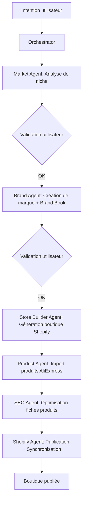
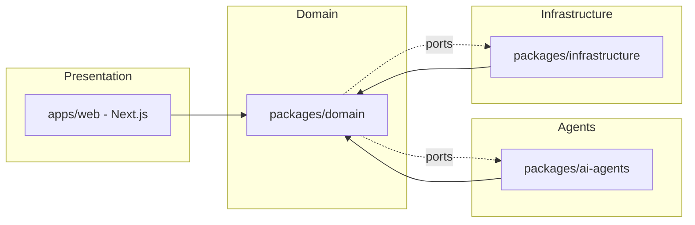
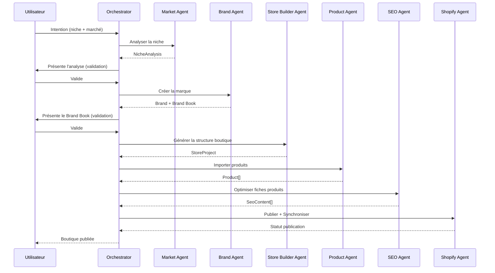
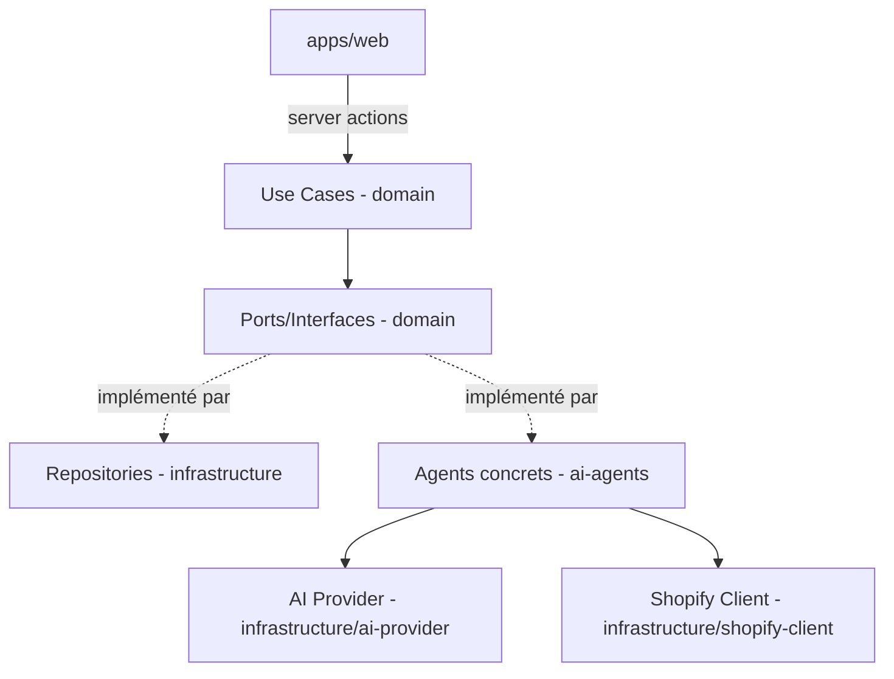
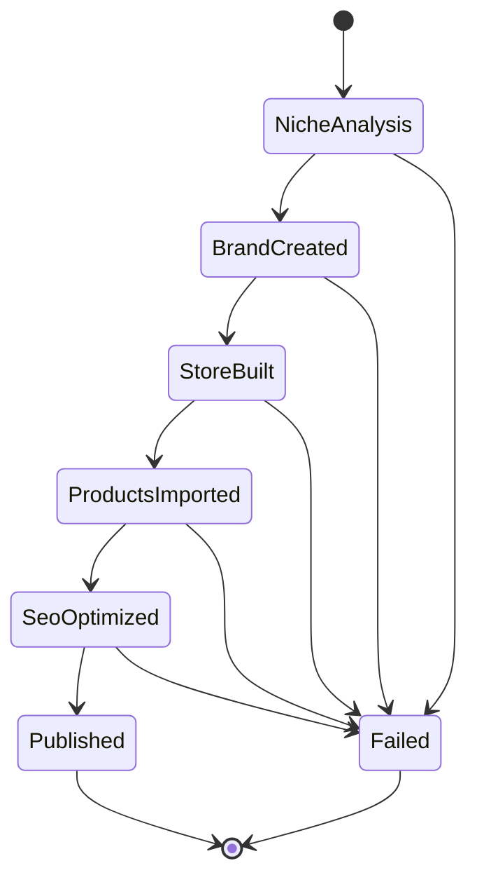

# ARCHITECTURE — BrandForge AI
Version : 1.0 (Draft initial)
Statut : En rédaction — à valider avant tout développement
Basé sur : PRD.md v1.0

---

## 1. Principes directeurs

- **Clean Architecture** : le cœur métier (domaine, agents, orchestration) ne dépend d'aucun framework, ni de Next.js, ni de Prisma, ni de Shopify directement.
- **Domain-Driven Design** : le système est découpé en Bounded Contexts alignés sur le métier (Branding, Market Intelligence, Store Building, Products, SEO, Publishing), pas sur des couches techniques.
- **Vertical Slice Architecture** : chaque fonctionnalité (ex. "générer un Brand Book") regroupe sa logique de bout en bout (use case, agent, persistance) plutôt que d'être éclatée horizontalement entre des dossiers `controllers/`, `services/`, `models/` génériques.
- **Aucune logique métier dans le frontend.** Next.js n'est qu'une couche de présentation et d'orchestration HTTP.

---

## 2. Arborescence des dossiers

```
brandforge-ai/
├── apps/
│   └── web/                        # Application Next.js (présentation uniquement)
│       ├── app/                    # Routes Next.js (App Router)
│       ├── components/             # Composants UI purs (shadcn/ui, Tailwind)
│       ├── server-actions/         # Points d'entrée fins qui appellent les use cases du domaine
│       └── lib/                    # Utilitaires spécifiques au frontend (formatage, hooks UI)
│
├── packages/
│   ├── domain/                     # CŒUR MÉTIER — indépendant de tout framework
│   │   ├── branding/                # Bounded Context : Branding
│   │   │   ├── entities/
│   │   │   ├── value-objects/
│   │   │   ├── use-cases/
│   │   │   └── ports/               # Interfaces (contrats) que l'infra doit implémenter
│   │   ├── market-intelligence/     # Bounded Context : Market Intelligence
│   │   ├── store-building/          # Bounded Context : Store Building
│   │   ├── products/                # Bounded Context : Products
│   │   ├── seo/                     # Bounded Context : SEO
│   │   ├── publishing/              # Bounded Context : Publishing (Shopify)
│   │   └── orchestration/           # Bounded Context : Orchestration des agents (pipeline)
│   │
│   ├── ai-agents/                   # Implémentations concrètes des agents IA
│   │   ├── market-agent/
│   │   ├── brand-agent/
│   │   ├── store-builder-agent/
│   │   ├── product-agent/
│   │   ├── seo-agent/
│   │   ├── image-agent/             # (V2)
│   │   ├── shopify-agent/
│   │   ├── blog-agent/              # (V2)
│   │   └── marketing-agent/         # (V2)
│   │
│   ├── infrastructure/              # Implémentations techniques des "ports" du domaine
│   │   ├── database/                 # Prisma, repositories concrets
│   │   ├── ai-provider/               # Client Groq (interchangeable)
│   │   ├── shopify-client/            # Wrapper Admin API + Storefront API
│   │   └── scraping/                  # Extension Chrome / import AliExpress
│   │
│   └── shared/                      # Types, erreurs, constantes partagés (SANS logique métier)
│
├── extension-chrome/                # Extension Chrome (import AliExpress), projet à part
│
├── docs/                            # Documentation vivante du projet
│   ├── PRD.md
│   ├── ARCHITECTURE.md
│   ├── DATABASE.md
│   ├── AI_AGENTS.md
│   ├── API.md
│   ├── SHOPIFY.md
│   ├── SEO.md
│   ├── WORKFLOWS.md
│   ├── CODING_STANDARDS.md
│   └── DECISIONS/
│
├── prisma/                          # Schéma de base de données (référencé par packages/infrastructure)
├── docker/
└── package.json                     # Monorepo (workspaces)
```

### Rôle précis de chaque dossier clé

| Dossier | Rôle |
|---|---|
| `apps/web` | Présentation uniquement. Aucune règle métier. Appelle des use cases exposés par `packages/domain`. |
| `packages/domain` | Le cœur. Entités, règles métier, use cases, et **ports** (interfaces) que l'infrastructure doit respecter. Ne connaît ni Prisma, ni Shopify, ni Groq. |
| `packages/ai-agents` | Chaque agent implémente un contrat défini dans `domain/orchestration`. Un agent = une classe/module qui reçoit une entrée typée et retourne une sortie typée. |
| `packages/infrastructure` | Implémentations concrètes des ports (ex. `IProductRepository` implémenté par Prisma, `IEcommercePlatform` implémenté par Shopify). |
| `packages/shared` | Types, erreurs et constantes transverses. Aucune logique métier, aucune dépendance vers `domain`. |
| `extension-chrome` | Isolée du reste : dépend du DOM d'AliExpress, doit pouvoir casser/être réparée sans affecter le cœur du système. |

---

## 3. Dépendances autorisées et interdites

### Autorisées
```
apps/web            → packages/domain (via server-actions uniquement)
packages/ai-agents   → packages/domain (implémente les ports d'orchestration)
packages/infrastructure → packages/domain (implémente les ports de repository/service)
packages/domain      → packages/shared
packages/ai-agents   → packages/shared
packages/infrastructure → packages/shared
```

### Interdites (règles strictes)
- ❌ `packages/domain` → `packages/infrastructure` (le domaine ne doit JAMAIS connaître Prisma, Shopify, Groq directement).
- ❌ `packages/domain` → `apps/web` (le domaine ne connaît pas Next.js/React).
- ❌ `apps/web` → `packages/infrastructure` directement (toujours passer par un use case du domaine).
- ❌ `packages/ai-agents` → `apps/web` (un agent ne doit jamais dépendre de la couche de présentation).
- ❌ Logique métier dans `apps/web/components` ou `apps/web/app`.
- ❌ Appels HTTP directs à Shopify ou Groq depuis un composant React.

Cette inversion de dépendance (le domaine définit des interfaces, l'infrastructure les implémente) est ce qui permet de changer de fournisseur IA ou de plateforme e-commerce sans réécrire le cœur du système.

---

## 4. Conventions de nommage

- **Entités du domaine** : PascalCase singulier (`Brand`, `NicheAnalysis`, `Product`, `StorePipeline`).
- **Use cases** : verbe à l'infinitif + objet (`CreateBrand`, `AnalyzeNiche`, `PublishStore`, `ImportProduct`).
- **Ports (interfaces)** : préfixe `I` (`IEcommercePlatform`, `IAiProvider`, `IProductRepository`).
- **Agents IA** : suffixe `Agent` (`MarketAgent`, `BrandAgent`, `ShopifyAgent`).
- **Fichiers** : kebab-case (`create-brand.usecase.ts`, `market-agent.ts`).
- **Bounded Contexts** : un dossier = un contexte, nommé au singulier métier, pas technique (`branding`, pas `brand-management-system`).
- **Événements du pipeline** : passé composé (`BrandCreated`, `NicheAnalyzed`, `StorePublished`).

---

## 5. Domain Models (aperçu)

- **NicheAnalysis** : niche, motsClés[], concurrents[], fourchettePrix, scorePertinence.
- **Brand** : nom, positionnement, brandBook (palette, typographie, ton éditorial, logoUrl).
- **StoreProject** : id, brand, statutPipeline, historiqueÉtapes[].
- **Product** : sourceUrl (AliExpress), titreOriginal, titreRéécrit, description, images[], prix, statutSEO.
- **SeoContent** : produitId ou articleId, motsClésCibles[], contenuOptimisé.
- **PipelineRun** : projectId, étapes[] (agent, statut, timestamp, résultat/erreur).

---

## 6. Bounded Contexts

| Bounded Context | Responsabilité |
|---|---|
| **Market Intelligence** | Analyse de niche, concurrence, mots-clés, positionnement. |
| **Branding** | Création de marque, Brand Book, logo, palette, ton éditorial. |
| **Store Building** | Génération de la structure Shopify (thème, collections, pages). |
| **Products** | Import, réécriture, gestion des fiches produits. |
| **SEO** | Optimisation des fiches produits et génération d'articles. |
| **Publishing** | Publication et synchronisation avec Shopify. |
| **Orchestration** | Coordination du pipeline complet, gestion de l'état d'exécution, reprise sur erreur. |

Chaque Bounded Context expose ses use cases via des interfaces claires ; les autres contextes ne connaissent jamais les détails internes d'un autre.

---

## 7. Modules du système et responsabilités

- **Orchestrator** : reçoit l'intention utilisateur, détermine la séquence d'agents à exécuter, gère l'état du pipeline (`PipelineRun`), gère les reprises partielles (cas d'usage n°2 du PRD).
- **Market Agent** : produit une `NicheAnalysis` à partir d'une niche donnée.
- **Brand Agent** : produit une `Brand` (nom, Brand Book) à partir d'une `NicheAnalysis` validée.
- **Store Builder Agent** : génère la structure Shopify à partir d'une `Brand` validée.
- **Product Agent** : importe et normalise des `Product` (via le port `IProductSource`, implémenté par le module `scraping` pour AliExpress).
- **SEO Agent** : produit du `SeoContent` à partir d'un `Product` ou d'un thème d'article.
- **Image Agent** *(V2)* : génère/retouche des visuels.
- **Shopify Agent** : publie/synchronise via le port `IEcommercePlatform`.
- **Blog Agent** *(V2)*, **Marketing Agent** *(V2)* : hors périmètre MVP, mais leurs ports sont anticipés dans `domain/orchestration` pour faciliter leur ajout futur.

---

## 8. Workflow complet (pipeline MVP)



---

## 9. Diagrammes Mermaid

### 9.1 Architecture globale



### 9.2 Flux des données (cas d'usage n°1)



### 9.3 Communication entre modules (dépendances)



### 9.4 Pipeline des agents IA (état du pipeline)



---

## 10. Points d'extension futurs

- **Changer de fournisseur IA** : implémenter un nouveau `IAiProvider` dans `infrastructure/ai-provider`, sans toucher aux agents ni au domaine.
- **Supporter une autre plateforme e-commerce que Shopify** : implémenter `IEcommercePlatform` (ex. WooCommerce), le `Store Builder Agent` et le `Shopify Agent` restent inchangés dans leur contrat.
- **Ajouter l'Image Agent (V2)** : le port existe déjà dans `domain/orchestration`, il suffit d'ajouter l'implémentation dans `ai-agents/image-agent`.
- **Multi-projets / persona Agence (V3)** : le modèle `StoreProject` est déjà pensé comme une entité indépendante rattachée à un utilisateur, ce qui permettra la gestion de plusieurs projets sans refonte.
- **Autre source de produits que AliExpress** : le port `IProductSource` permet d'ajouter d'autres connecteurs sans modifier le `Product Agent`.

---

## 11. Principes SOLID appliqués

- **S — Single Responsibility** : chaque agent a une seule responsabilité (un agent = un Bounded Context = une compétence).
- **O — Open/Closed** : l'ajout d'un nouvel agent (Image, Blog, Marketing) se fait par extension (nouveau module implémentant un port), sans modifier l'orchestrateur existant.
- **L — Liskov Substitution** : toute implémentation d'un port (`IAiProvider`, `IEcommercePlatform`) doit être interchangeable sans changer le comportement attendu par le domaine.
- **I — Interface Segregation** : les ports sont fins et spécifiques (`IProductRepository` ≠ `IProductSource` ≠ `IEcommercePlatform`), pas une interface fourre-tout.
- **D — Dependency Inversion** : le domaine définit les interfaces, l'infrastructure et les agents en dépendent — jamais l'inverse.

---

## 12. Design Patterns recommandés

- **Strategy Pattern** : pour les agents interchangeables (ex. changer d'implémentation du Brand Agent sans changer l'orchestrateur).
- **Repository Pattern** : pour l'accès aux données via Prisma, dissimulé derrière des interfaces du domaine.
- **Adapter Pattern** : pour envelopper les API externes (Shopify, Groq, AliExpress) derrière des ports du domaine.
- **Saga / Orchestrator Pattern** : pour le pipeline multi-étapes avec possibilité de reprise partielle en cas d'échec (cf. `PipelineRun`).
- **Factory Pattern** : pour instancier dynamiquement le bon agent selon l'étape du pipeline.
- **Observer / Event-driven (léger)** : pour notifier le frontend de la progression du pipeline (ex. `BrandCreated`, `StorePublished`) sans coupler l'orchestrateur à la couche de présentation.

---

## 13. Prochaines étapes

Une fois cette architecture validée :
1. Verrouillage de la version 1.0 (`/docs/ARCHITECTURE.md` + entrée dans `/docs/DECISIONS/`).
2. Rédaction du document **DATABASE.md** (modèle de données détaillé, schéma Prisma).
3. Rédaction du document **AI_AGENTS.md** (contrats d'entrée/sortie précis de chaque agent).
4. Aucun code ne sera écrit avant validation de ces deux documents.
