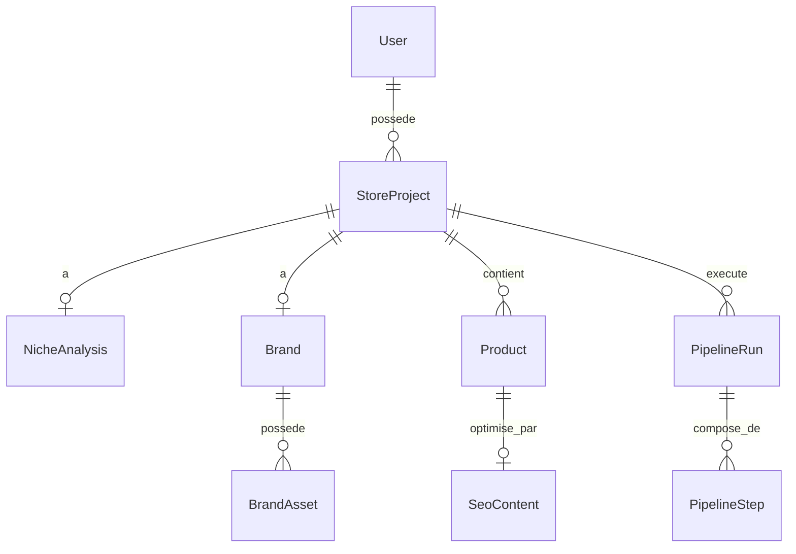

# DATABASE — BrandForge AI
Version : 1.0 (Draft initial)
Statut : En rédaction — à valider avant développement
Basé sur : PRD.md v1.0, ARCHITECTURE.md v1.0

---

## 1. Principes de modélisation

- Une table par entité du domaine identifiée dans `ARCHITECTURE.md` (Domain Models).
- Les entités sont rattachées à un `StoreProject`, qui est lui-même rattaché à un `User` — cela anticipe le multi-projets (V3) sans le complexifier maintenant.
- Le pipeline (`PipelineRun` / `PipelineStep`) est journalisé indépendamment des entités métier, pour permettre le suivi et la reprise sur erreur (cf. WORKFLOWS.md à venir).
- Aucune logique métier dans le schéma : uniquement de la structure et des contraintes de données. Les règles métier restent dans `packages/domain`.

---

## 2. Modèle de données — vue d'ensemble



---

## 3. Description des tables

### User
Représente l'utilisateur du SaaS (toi, ou un futur utilisateur si le produit s'ouvre).

| Champ | Type | Description |
|---|---|---|
| id | UUID | Identifiant unique |
| email | String | Unique |
| passwordHash | String | Authentification |
| createdAt | DateTime | |
| updatedAt | DateTime | |

### StoreProject
Un projet = une marque en cours de création ou déjà lancée. C'est l'entité pivot du système.

| Champ | Type | Description |
|---|---|---|
| id | UUID | |
| userId | UUID (FK) | Propriétaire |
| name | String | Nom de travail du projet (avant validation du nom de marque définitif) |
| niche | String | Niche déclarée par l'utilisateur (ex. "lunettes de soleil") |
| targetMarket | String | Marché cible (ex. "France") |
| status | Enum (`PipelineStatus`) | Statut global du projet |
| createdAt | DateTime | |
| updatedAt | DateTime | |

### NicheAnalysis
Résultat produit par le Market Agent.

| Champ | Type | Description |
|---|---|---|
| id | UUID | |
| storeProjectId | UUID (FK, unique) | 1-1 avec StoreProject |
| keywords | String[] | Mots-clés identifiés |
| competitors | Json | Liste structurée des concurrents (nom, url, positionnement) |
| priceRangeMin | Decimal | |
| priceRangeMax | Decimal | |
| relevanceScore | Float | Score de pertinence de la niche |
| rawAnalysis | Json | Sortie brute de l'agent (traçabilité) |
| createdAt | DateTime | |

### Brand
Résultat produit par le Brand Agent.

| Champ | Type | Description |
|---|---|---|
| id | UUID | |
| storeProjectId | UUID (FK, unique) | 1-1 avec StoreProject |
| name | String | Nom de marque validé |
| positioning | String | Positionnement/pitch de marque |
| tone | String | Ton éditorial (ex. "premium, épuré, confiant") |
| colorPalette | Json | Couleurs (hex + rôle : primaire, secondaire, accent) |
| typography | Json | Polices retenues |
| logoUrl | String | URL de l'asset logo généré |
| validatedByUser | Boolean | Indique si l'utilisateur a validé cette version |
| createdAt | DateTime | |

### BrandAsset
Fichiers/visuels liés à la marque (logo, variantes, éléments de Brand Book). Séparé de `Brand` pour supporter plusieurs assets sans complexifier la table principale.

| Champ | Type | Description |
|---|---|---|
| id | UUID | |
| brandId | UUID (FK) | |
| type | Enum (`AssetType`: LOGO, LOGO_VARIANT, BRAND_BOOK_PDF, COLOR_SWATCH...) | |
| url | String | |
| createdAt | DateTime | |

### Product
Produit importé (ex. via AliExpress) et enrichi par le Product Agent.

| Champ | Type | Description |
|---|---|---|
| id | UUID | |
| storeProjectId | UUID (FK) | |
| sourceUrl | String | URL d'origine (AliExpress) |
| sourcePlatform | Enum (`ProductSource`: ALIEXPRESS, MANUAL...) | |
| originalTitle | String | Titre original |
| rewrittenTitle | String | Titre réécrit |
| originalDescription | Text | |
| rewrittenDescription | Text | |
| images | String[] | URLs des images produit |
| price | Decimal | |
| shopifyProductId | String (nullable) | Référence une fois publié sur Shopify |
| status | Enum (`ProductStatus`: IMPORTED, REWRITTEN, SEO_OPTIMIZED, PUBLISHED) | |
| createdAt | DateTime | |
| updatedAt | DateTime | |

### SeoContent
Contenu SEO généré, rattaché à un produit (ou, en V2, à un article de blog — champ `productId` nullable pour anticiper).

| Champ | Type | Description |
|---|---|---|
| id | UUID | |
| productId | UUID (FK, nullable) | |
| targetKeywords | String[] | |
| metaTitle | String | |
| metaDescription | String | |
| optimizedContent | Text | |
| createdAt | DateTime | |

### PipelineRun
Une exécution du pipeline complet pour un `StoreProject` (permet de journaliser plusieurs tentatives/reprises).

| Champ | Type | Description |
|---|---|---|
| id | UUID | |
| storeProjectId | UUID (FK) | |
| status | Enum (`PipelineStatus`: RUNNING, COMPLETED, FAILED, PAUSED) | |
| startedAt | DateTime | |
| finishedAt | DateTime (nullable) | |

### PipelineStep
Chaque étape exécutée au sein d'un `PipelineRun` (une par agent).

| Champ | Type | Description |
|---|---|---|
| id | UUID | |
| pipelineRunId | UUID (FK) | |
| agentName | Enum (`AgentName`: MARKET, BRAND, STORE_BUILDER, PRODUCT, SEO, IMAGE, SHOPIFY, BLOG, MARKETING) | |
| status | Enum (`StepStatus`: PENDING, RUNNING, SUCCESS, FAILED, SKIPPED) | |
| input | Json | Entrée exacte reçue par l'agent (traçabilité/debug) |
| output | Json (nullable) | Sortie produite |
| errorMessage | String (nullable) | |
| startedAt | DateTime (nullable) | |
| finishedAt | DateTime (nullable) | |

---

## 4. Schéma Prisma (draft)

```prisma
generator client {
  provider = "prisma-client-js"
}

datasource db {
  provider = "postgresql"
  url      = env("DATABASE_URL")
}

enum PipelineStatus {
  DRAFT
  RUNNING
  COMPLETED
  FAILED
  PAUSED
}

enum AssetType {
  LOGO
  LOGO_VARIANT
  BRAND_BOOK_PDF
  COLOR_SWATCH
}

enum ProductSource {
  ALIEXPRESS
  MANUAL
}

enum ProductStatus {
  IMPORTED
  REWRITTEN
  SEO_OPTIMIZED
  PUBLISHED
}

enum AgentName {
  MARKET
  BRAND
  STORE_BUILDER
  PRODUCT
  SEO
  IMAGE
  SHOPIFY
  BLOG
  MARKETING
}

enum StepStatus {
  PENDING
  RUNNING
  SUCCESS
  FAILED
  SKIPPED
}

model User {
  id            String         @id @default(uuid())
  email         String         @unique
  passwordHash  String
  storeProjects StoreProject[]
  createdAt     DateTime       @default(now())
  updatedAt     DateTime       @updatedAt
}

model StoreProject {
  id            String          @id @default(uuid())
  userId        String
  user          User            @relation(fields: [userId], references: [id])
  name          String
  niche         String
  targetMarket  String
  status        PipelineStatus  @default(DRAFT)

  nicheAnalysis NicheAnalysis?
  brand         Brand?
  products      Product[]
  pipelineRuns  PipelineRun[]

  createdAt     DateTime        @default(now())
  updatedAt     DateTime        @updatedAt
}

model NicheAnalysis {
  id              String       @id @default(uuid())
  storeProjectId  String       @unique
  storeProject    StoreProject @relation(fields: [storeProjectId], references: [id])
  keywords        String[]
  competitors     Json
  priceRangeMin   Decimal
  priceRangeMax   Decimal
  relevanceScore  Float
  rawAnalysis     Json
  createdAt       DateTime     @default(now())
}

model Brand {
  id                String        @id @default(uuid())
  storeProjectId    String        @unique
  storeProject      StoreProject  @relation(fields: [storeProjectId], references: [id])
  name              String
  positioning       String
  tone              String
  colorPalette      Json
  typography        Json
  logoUrl           String
  validatedByUser   Boolean       @default(false)
  assets            BrandAsset[]
  createdAt         DateTime      @default(now())
}

model BrandAsset {
  id        String    @id @default(uuid())
  brandId   String
  brand     Brand     @relation(fields: [brandId], references: [id])
  type      AssetType
  url       String
  createdAt DateTime  @default(now())
}

model Product {
  id                    String         @id @default(uuid())
  storeProjectId        String
  storeProject          StoreProject   @relation(fields: [storeProjectId], references: [id])
  sourceUrl             String
  sourcePlatform        ProductSource
  originalTitle         String
  rewrittenTitle        String?
  originalDescription   String
  rewrittenDescription  String?
  images                String[]
  price                 Decimal
  shopifyProductId      String?
  status                ProductStatus  @default(IMPORTED)
  seoContent            SeoContent?
  createdAt             DateTime       @default(now())
  updatedAt             DateTime       @updatedAt
}

model SeoContent {
  id                String    @id @default(uuid())
  productId         String?   @unique
  product           Product?  @relation(fields: [productId], references: [id])
  targetKeywords    String[]
  metaTitle         String
  metaDescription   String
  optimizedContent  String
  createdAt         DateTime  @default(now())
}

model PipelineRun {
  id              String          @id @default(uuid())
  storeProjectId  String
  storeProject    StoreProject    @relation(fields: [storeProjectId], references: [id])
  status          PipelineStatus  @default(RUNNING)
  steps           PipelineStep[]
  startedAt       DateTime        @default(now())
  finishedAt      DateTime?
}

model PipelineStep {
  id             String        @id @default(uuid())
  pipelineRunId  String
  pipelineRun    PipelineRun   @relation(fields: [pipelineRunId], references: [id])
  agentName      AgentName
  status         StepStatus    @default(PENDING)
  input          Json
  output         Json?
  errorMessage   String?
  startedAt      DateTime?
  finishedAt     DateTime?
}
```

---

## 5. Points d'attention

- **Traçabilité** : `input`/`output` en `Json` sur `PipelineStep` permettent de rejouer ou déboguer une étape précise sans dépendre des logs applicatifs.
- **Reprise sur erreur** : un `PipelineRun` en `FAILED` peut être relancé en ne réexécutant que les `PipelineStep` non `SUCCESS` (logique portée par l'Orchestrator, pas par la base).
- **Multi-projets (V3)** : la relation `User → StoreProject[]` est déjà en place, aucune migration structurelle ne sera nécessaire pour l'ouvrir à plusieurs projets simultanés.
- **Extension future (Image Agent, Blog Agent)** : `AgentName` et `BrandAsset.type` sont des enums déjà dimensionnés pour accueillir ces agents sans migration lourde.

---

## 6. Prochaines étapes

Une fois ce document validé :
1. Verrouillage de la version 1.0 (`/docs/DATABASE.md` + entrée dans `/docs/DECISIONS/`).
2. Rédaction du document **AI_AGENTS.md** (contrat précis d'entrée/sortie de chaque agent, en s'appuyant sur ces modèles de données).
3. Toujours aucun code applicatif tant que AI_AGENTS.md et API.md ne sont pas validés.
