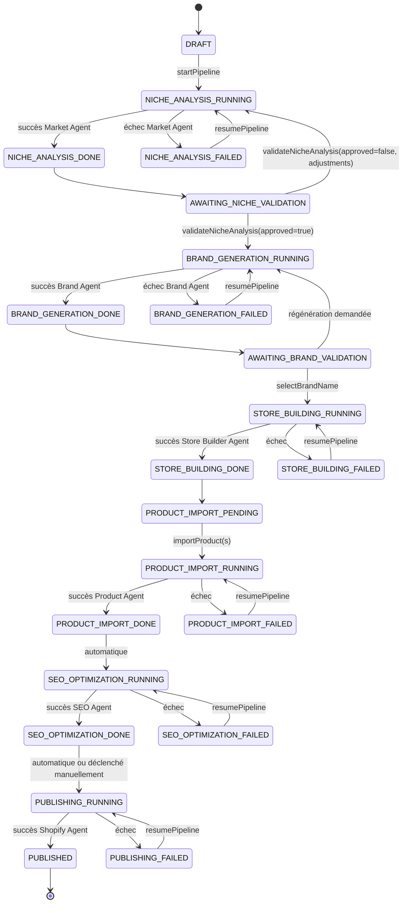

# WORKFLOWS — BrandForge AI
Version : 1.0 (Draft initial)
Statut : En rédaction — à valider avant développement
Basé sur : PRD.md, ARCHITECTURE.md, DATABASE.md, AI_AGENTS.md, API.md (v1.0)

---

## 1. Rôle de l'Orchestrator

L'Orchestrator est le seul module autorisé à :
- Séquencer l'appel des agents dans le bon ordre.
- Décider si le pipeline doit s'arrêter pour attendre une validation utilisateur.
- Créer et mettre à jour les `PipelineRun` / `PipelineStep` (cf. DATABASE.md).
- Décider si une erreur est bloquante ou si le pipeline peut continuer/reprendre.

Aucun agent n'appelle un autre agent. Aucune Server Action ne séquence plusieurs use cases métier — cette responsabilité appartient exclusivement à l'Orchestrator.

---

## 2. Machine à états du pipeline

**Remarque** : ces états détaillés (`NICHE_ANALYSIS_RUNNING`, etc.) sont une granularité interne à l'Orchestrator. Au niveau de la table `StoreProject.status` (DATABASE.md), on ne persiste que l'enum simplifié `PipelineStatus` (`DRAFT`, `RUNNING`, `COMPLETED`, `FAILED`, `PAUSED`) ; le détail fin de l'état vit dans le dernier `PipelineStep` du `PipelineRun` courant.

---

## 3. Points de validation utilisateur (bloquants par design)

Le pipeline s'arrête **toujours** à ces étapes, sans exception, même si tout s'est bien passé techniquement :

| Étape | Action utilisateur requise | Action associée (cf. API.md) |
|---|---|---|
| Après l'analyse de niche | Valider ou demander un ajustement | `validateNicheAnalysis` |
| Après la génération de marque | Choisir le nom définitif | `selectBrandName` |

**Pourquoi ces deux points et pas d'autres ?**
Ce sont les deux décisions qui engagent irréversiblement l'identité du projet (le positionnement, puis le nom). Le reste du pipeline (construction boutique, import produits, SEO, publication) est réversible ou ajustable sans tout recommencer, donc il peut s'exécuter en continu (le MVP privilégie l'automatisation dès que c'est sans risque produit).

L'utilisateur peut néanmoins interrompre manuellement le pipeline à tout moment via `resumePipeline`/une action `pausePipeline` (à ajouter si besoin en cours de dev), mais ce n'est pas un point de blocage obligatoire.

---

## 4. Gestion des erreurs

### 4.1 Erreurs `retryable: true`
(ex. `AI_PROVIDER_TIMEOUT`, `SHOPIFY_RATE_LIMIT`)
- L'Orchestrator marque le `PipelineStep` en `FAILED`, le `PipelineRun` en `FAILED`.
- Une **reprise automatique avec backoff exponentiel** est tentée (nombre de tentatives configurable, ex. 3 essais max), avant de passer la main à l'utilisateur.
- Si les tentatives automatiques échouent, le projet reste en `FAILED` jusqu'à un `resumePipeline` explicite.

### 4.2 Erreurs `retryable: false`
(ex. `NICHE_TOO_VAGUE`, `PRODUCT_DATA_INCOMPLETE`, `SHOPIFY_AUTH_ERROR`)
- Aucune tentative automatique.
- Le `PipelineRun` passe en `FAILED` immédiatement, avec un message clair transmis au frontend expliquant l'action corrective attendue (ex. "reformulez la niche", "reconnectez votre boutique Shopify").

### 4.3 Reprise (`resumePipeline`)
- Ne réexécute **que** le dernier `PipelineStep` en échec (et les suivants), jamais tout le pipeline depuis le début.
- Les `PipelineStep` déjà en `SUCCESS` ne sont jamais recalculés automatiquement (pour éviter d'écraser une validation déjà faite par l'utilisateur).

---

## 5. Cas particulier — import de produits en masse

L'import de produits (`importProductsBatch`) n'est pas strictement séquentiel comme le reste du pipeline :
- Chaque produit est traité indépendamment (un `PipelineStep` par produit, ou un sous-lot).
- Un échec sur un produit **ne bloque pas** les autres.
- Le statut global de l'étape "Product Import" passe en `PARTIAL_SUCCESS` si au moins un produit a échoué, visible dans le dashboard, sans bloquer la suite du pipeline (SEO/publication peuvent s'exécuter sur les produits réussis).

---

## 6. Notification du frontend

Pour le MVP : le frontend interroge périodiquement `getPipelineStatus` (polling, ex. toutes les 3-5 secondes pendant qu'un `PipelineRun` est `RUNNING`).
Une évolution vers un canal temps réel (WebSocket / Server-Sent Events) est un point d'extension identifié pour la V2, sans impact sur le contrat `PipelineStepSummary` déjà défini dans `API.md`.

---

## 7. Règle d'or de l'Orchestrator

> L'Orchestrator ne contient aucune règle de génération de contenu (ça, c'est le rôle des agents). Il ne contient que de la logique de **séquencement, d'état et de décision de reprise**. Si une logique "que faire avec le résultat" apparaît dans l'Orchestrator, c'est un signal qu'elle devrait plutôt vivre dans l'agent concerné ou dans un use case dédié.

---

## 8. Prochaines étapes

Une fois ce document validé :
1. Verrouillage de la version 1.0 (`/docs/WORKFLOWS.md` + entrée dans `/docs/DECISIONS/`).
2. Rédaction du dernier document avant code : **CODING_STANDARDS.md** (nommage, structure de fichiers, conventions de tests, gestion des timeouts par défaut mentionnés dans AI_AGENTS.md).
3. Ensuite : début du développement, module par module, dans l'ordre déjà défini (setup monorepo → domain → infrastructure/database → Market Agent → ...).
